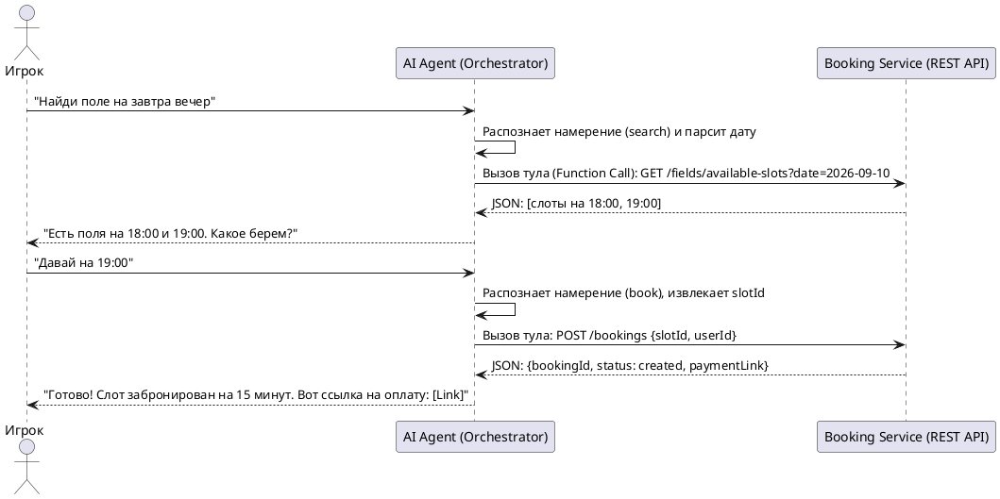

# Sequence: Бронирование через AI-агента

Накидал текстовое описание для Sequence-диаграммы. Позже закину это в PlantUML.

```plantuml
@startuml
actor Игрок as User
participant "AI Agent (Orchestrator)" as Agent
participant "Booking Service (REST API)" as API

User -> Agent: "Найди поле на завтра вечер"
Agent -> Agent: Распознает намерение (search) и парсит дату
Agent -> API: Вызов тула (Function Call): GET /fields/available-slots?date=2026-09-10
API --> Agent: JSON: [слоты на 18:00, 19:00]
Agent --> User: "Есть поля на 18:00 и 19:00. Какое берем?"
User -> Agent: "Давай на 19:00"
Agent -> Agent: Распознает намерение (book), извлекает slotId
Agent -> API: Вызов тула: POST /bookings {slotId, userId}
API --> Agent: JSON: {bookingId, status: created, paymentLink}
Agent --> User: "Готово! Слот забронирован на 15 минут. Вот ссылка на оплату: [Link]"
@enduml
```
